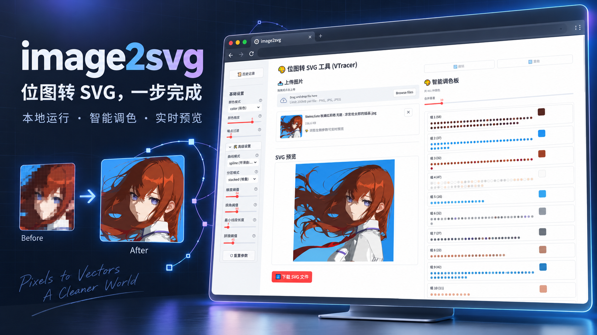

# image2svg



A local bitmap-to-SVG converter with a Streamlit interface and a FastAPI endpoint. It uses [VTracer](https://github.com/visioncortex/vtracer) for high-quality color vectorization when available, and falls back to basic monochrome contour tracing without it.

## Features

- Converts PNG, JPG, and JPEG images to SVG.
- Exposes VTracer color, curve, and layering controls.
- Previews SVG output, supports palette edits, and downloads results in the browser.
- Provides both a local graphical interface and an HTTP API.
- Keeps runtime files in `.image2svg/`, outside version control.

## Requirements

- Python 3.10 or newer.
- Recommended: install VTracer and make `vtracer` available on your `PATH`. You can also point `VTRACER_PATH` at its executable.

VTracer supports Windows, macOS, and Linux. This repository does not distribute VTracer binaries or other platform-specific third-party artifacts.

## Installation

```bash
git clone https://github.com/XIFPASON/image2svg.git
cd image2svg
python -m venv .venv
```

Activate the environment, then install the project:

```bash
pip install -e .
```

Start the graphical interface:

```bash
python -m streamlit run frontend/app.py
```

On Windows, you can also use `./run_gui.ps1`. The app is available at `http://localhost:8501` by default.

## HTTP API

```bash
uvicorn backend.api.app:app --reload
curl -F "file=@example.png" http://127.0.0.1:8000/convert
```

The response includes a task ID and a result URL. Poll `GET /result/{task_id}`; it returns the SVG when conversion completes. The default API upload limit is 20 MiB and can be configured with `IMAGE2SVG_MAX_UPLOAD_BYTES`.

## Configuration

| Environment variable | Purpose |
| --- | --- |
| `VTRACER_PATH` | Absolute or relative path to the VTracer executable. |
| `IMAGE2SVG_DATA_DIR` | Upload and output location. Defaults to `.image2svg/`. |
| `IMAGE2SVG_MAX_UPLOAD_BYTES` | Maximum API upload size. Defaults to `20971520`. |

This is designed as a local tool. Before exposing the API publicly, add authentication, rate limiting, file-retention rules, and request-size limits at the reverse-proxy layer.

## Credits

The default vectorization path is powered by [VTracer](https://github.com/visioncortex/vtracer). Its algorithms and implementation belong to VisionCortex and its contributors. This project also relies on FastAPI, Streamlit, Pillow, NumPy, OpenCV, svgwrite, python-multipart, and Uvicorn.

See [Third-Party Notices](THIRD_PARTY_NOTICES.md) for source, usage, and license details. This repository's MIT license applies only to code authored for image2svg and does not replace any upstream license.

## Development

```bash
pip install -e ".[dev]"
pytest
```

Read [Contributing](CONTRIBUTING.md) before opening a pull request. image2svg is released under the [MIT License](LICENSE); third-party components remain subject to their own licenses.
